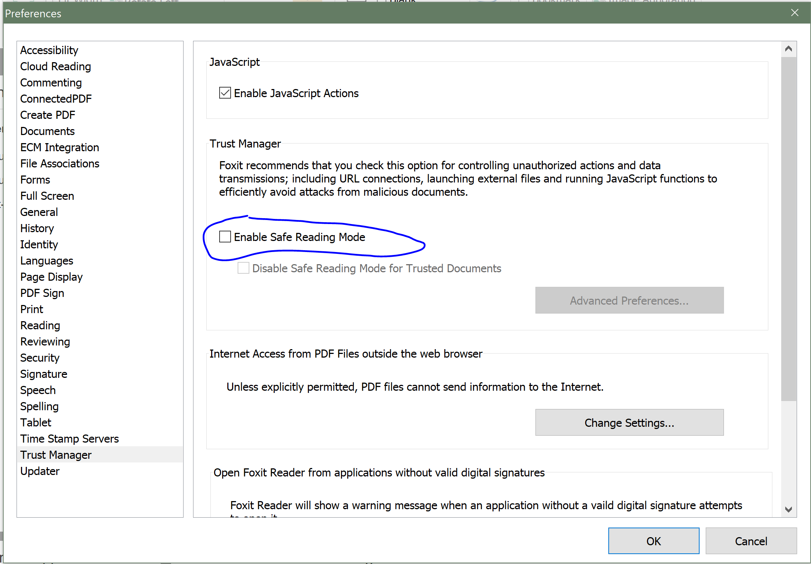
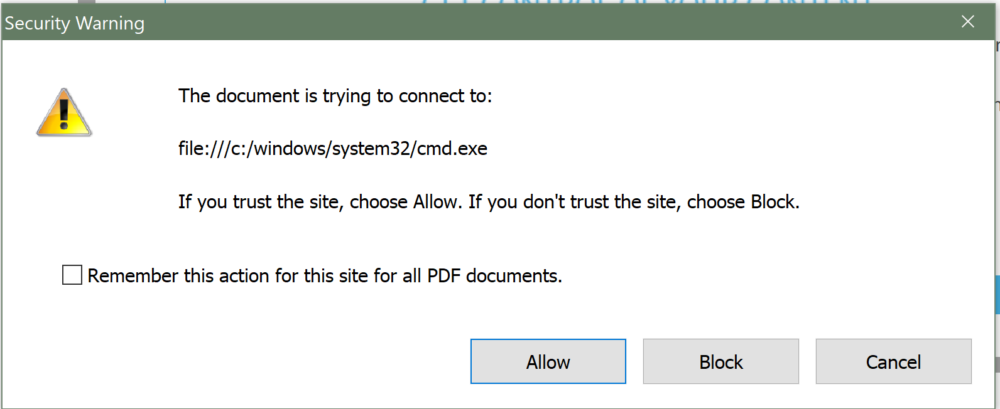

# CVE-2017-10951

We can extend CVE-2017-10952 to leverage the exploit in CVE-2017-10951.  10951 requires that foxit reader have safe mode disabled, i.e.:

  1. File > Preferences > Trust Manager > ensure that "Safe Mode" is _unchecked_.



Once safe mode is disabled we modify document.pdf to take advantage of `app.launchURL` instead of `xfa.host.gotoURL`.  `app.launchURL` is intended to launch [URLs](https://en.wikipedia.org/wiki/URL) for websites, e.g. "https://google.com", not [URIs](https://en.wikipedia.org/wiki/Uniform_Resource_Identifier) for files on a system, e.g. "file:///C:/Windows/System32/cmd.exe".  

So let's modify document.pdf!

  1. make a copy of document.pdf 
  1. in your favorite text editor, edit `<event>` block starting on line 42:

```
  <event activity="docClose" ref="$host">
    <script contentType='application/x-javascript'>
        var user = identity.name;
        app.launchURL("file:///C:/Windows/System32/cmd.exe");
    </script>
  </event>
```

So this script will trigger upon the event that when the user closes the document (i.e. `docClose`), the script will launch and the URI will run.  What Foxit Reader is failing to evaluate the input for is that the input for `app.launchURL` is a [URL](https://en.wikipedia.org/wiki/URL) and not a [URI](https://en.wikipedia.org/wiki/Uniform_Resource_Identifier).  Note that _all_ URLs are URIs but _not all_ URIs are URLs and this software is failing to account for this distinction in safe mode.



Try re-enabling safe mode and open this document.  See what happens!