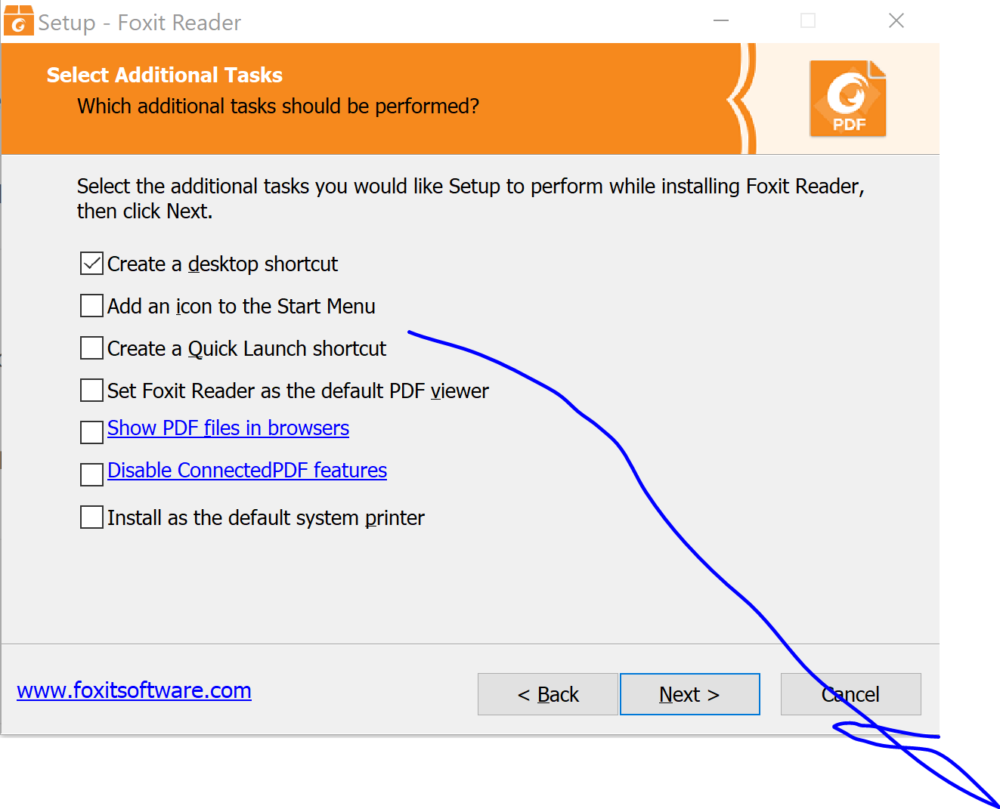
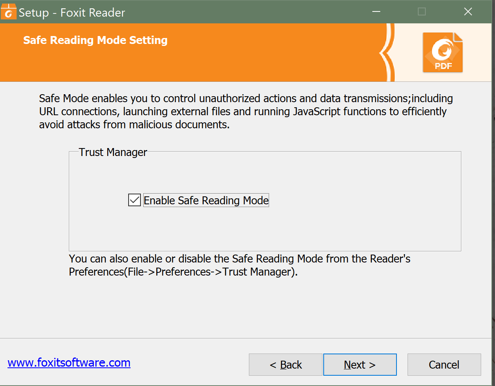
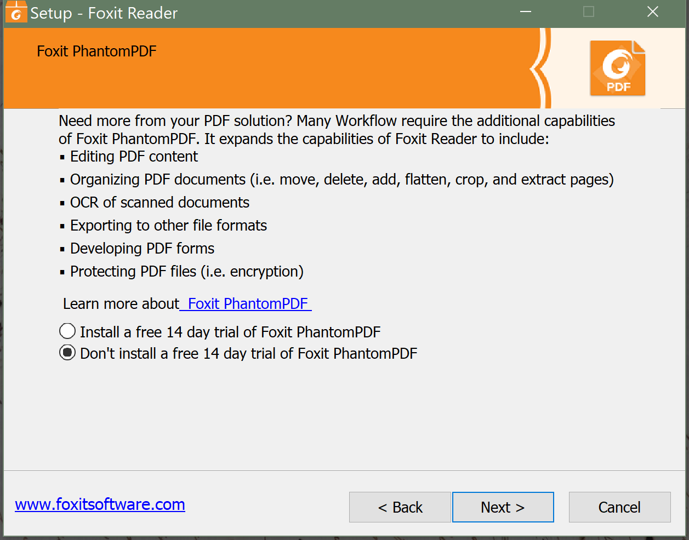

# CVE-2017-10952

So this is a high level example of a local code execution attack on Foxit PDF reader.  Details of this attack can be found [here](https://vulners.com/seebug/SSV:96369) [1].  I've copy pasted the text description of this vulnerability linked in [1] [here](./Root.md) to preserve the description over time - the description was written by the author Root on vulners.com.

## Install Foxit

Install Foxit_Reader_v8.3.0.14878.exe.  Step through the installation process.  Since this is just a high level demonstration of how to exploit this version of Foxit PDF reader, there is no need to modify browser or Windows default application settings to open PDF files; below are some screenshots of installation to help identify installation settings:

## Demonstration of Attack

  1. After installation of Foxit Reader, open the application.
  1. Open file explorer to this directory with "document.pdf" and "document2.pdf"
  1. Drag "document.pdf" to Foxit Reader.  This should open a print prompt.  Close the print prompt and close the document in Foxit.
  1. Next drag "document2.pdf" to Foxit Reader.  This should open the calc.exe app.  

### What's happening?

In both instances of the attacks, they leverage the XFA formatting for PDFs; an example of this is shown by [corkami](https://github.com/corkami/pics) [here](https://raw.githubusercontent.com/corkami/pocs/master/pdf/formevent_js.pdf).  A more thorough explanation of this exploit is found in the [link above](https://vulners.com/seebug/SSV:96369) under "[+] Fixed: Safe-Reading mode bypass".

[1] - https://vulners.com/seebug/SSV:96369
[2] - https://github.com/corkami/pics
[3] - https://raw.githubusercontent.com/corkami/pocs/master/pdf/formevent_js.pdf

## CVE-2017-10951

[Click here](./CVE-2017-10951.md) to see how we extend CVE-2017-10952 exploit into CVE-2017-10951.
